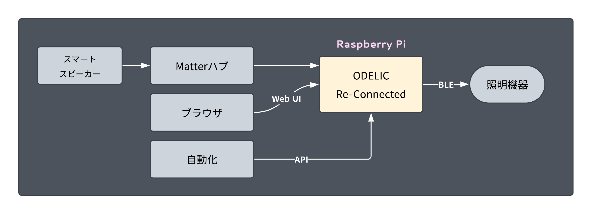
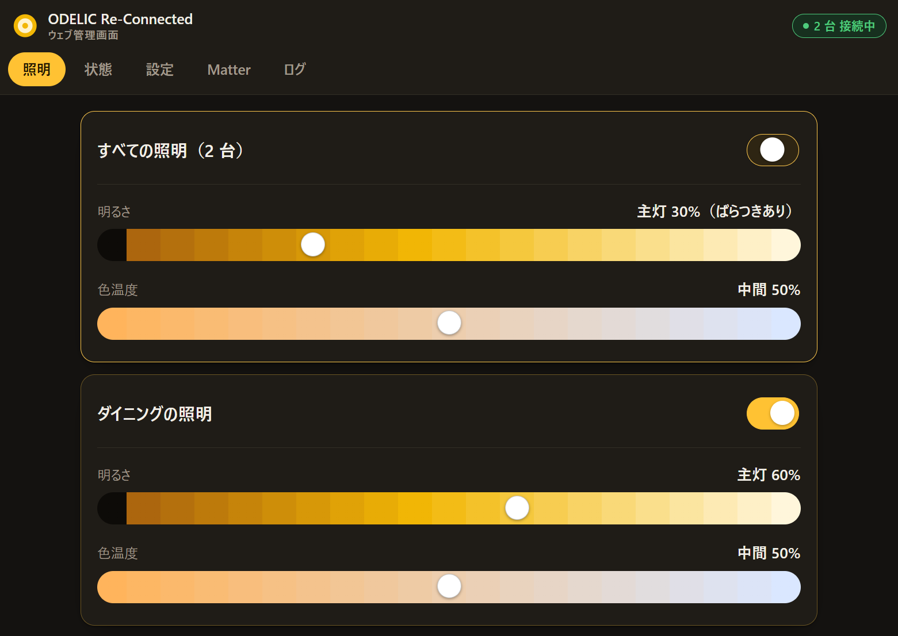
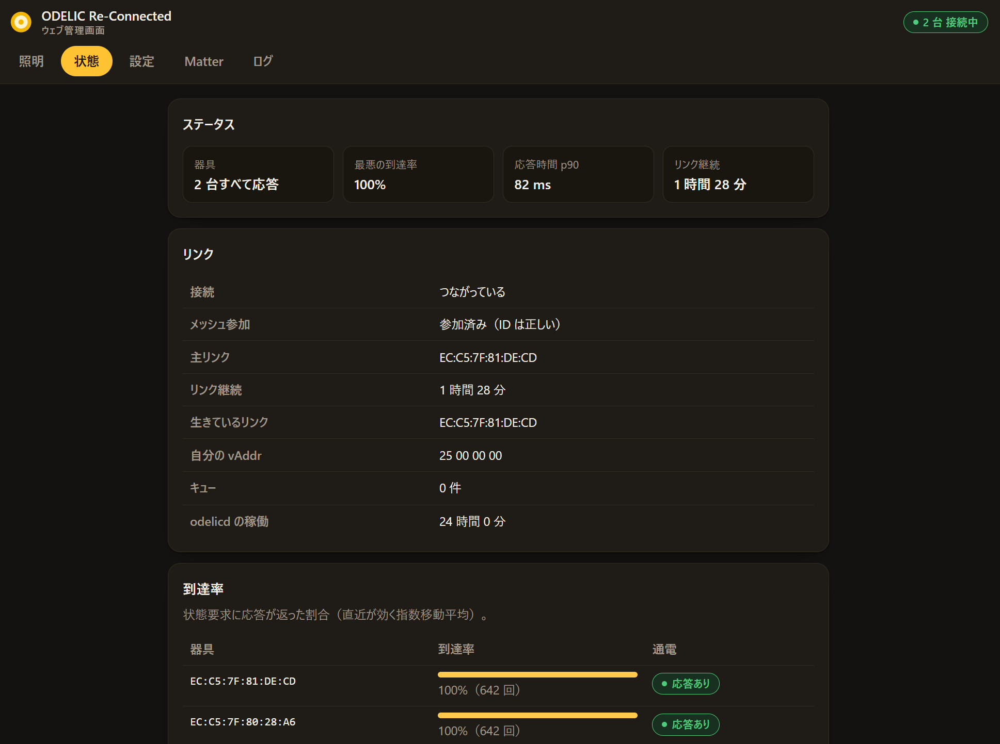
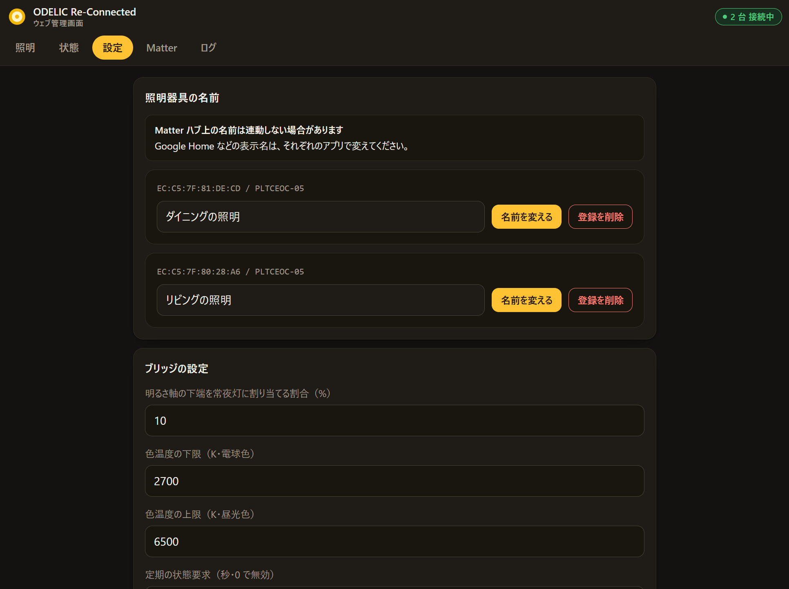
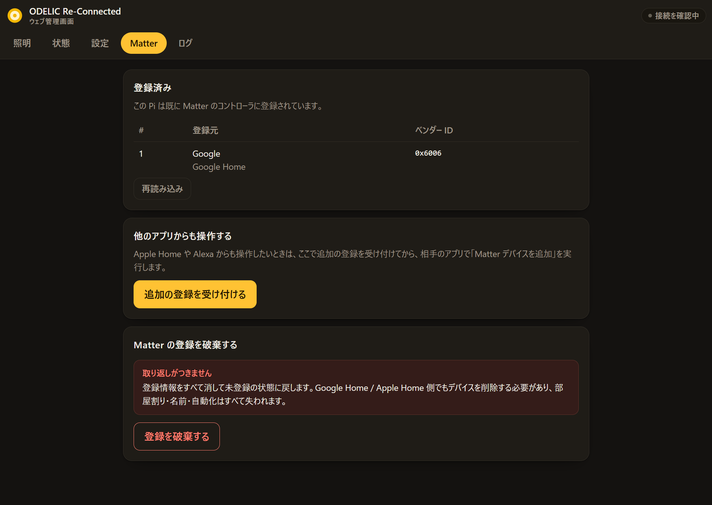
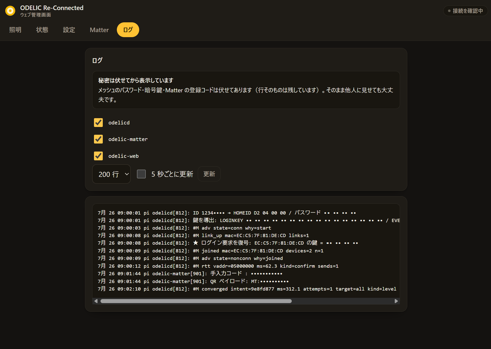
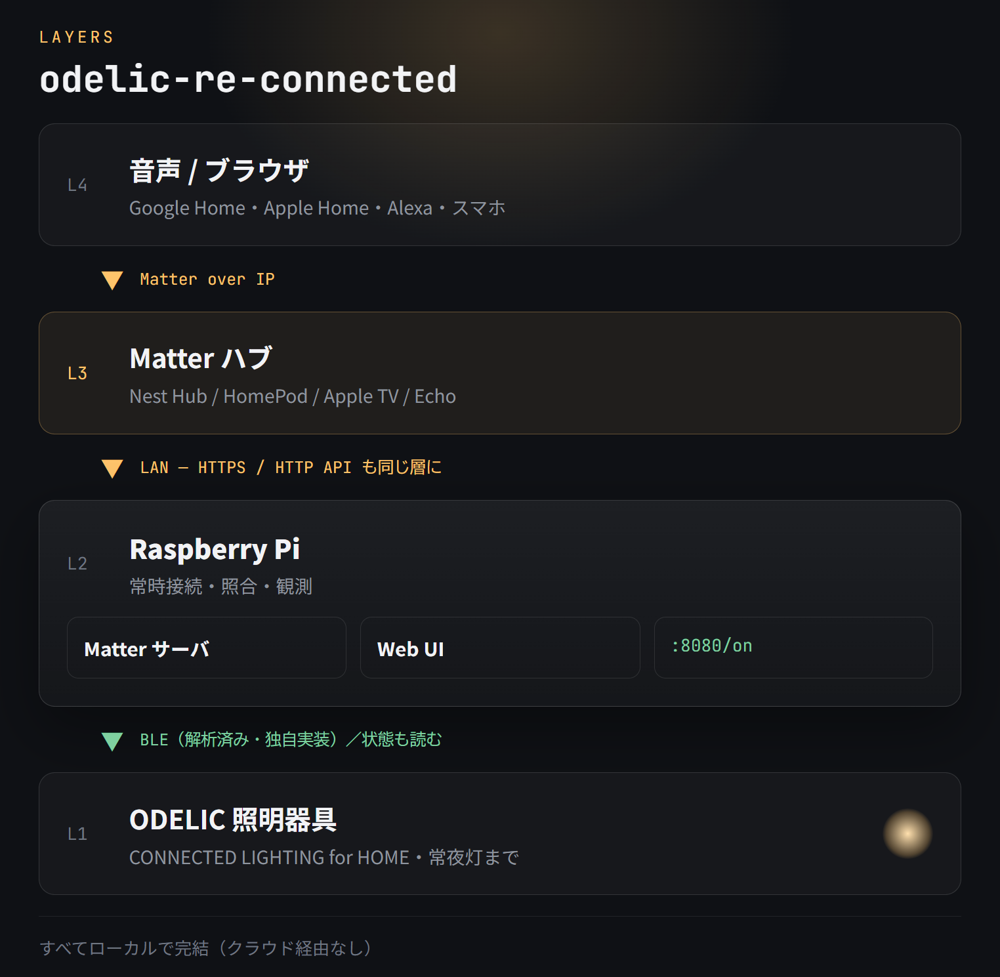

# odelic-re-connected

[](LICENSE)
[](docs/06-raspberrypi-setup.md)
[](docs/07-matter.md)

[「CONNECTED LIGHTING for HOME」](https://www.odelic.co.jp/products/connectedlighting/app/)に対応した照明器具を、Raspberry Pi から操作するためのツールキットです。




Google Home / Apple Home / Alexa から音声で操作したり、スマートフォンからブラウザで操作できるようになります。不安定な公式アプリに依存せず、ODELIC 製品を活用できるようになります。プロトコルの解析結果もすべて公開します。

---

## 目次

- [できること](#できること)
- [必要なもの](#必要なもの)
- [インストール](#インストール)
- [アップデート](#アップデート)
- [Google Home に追加する](#google-home-に追加する)
- [スマートフォンから操作する](#スマートフォンから操作する)
- [バックアップを取る](#バックアップを取る)
- [困ったとき](#困ったとき)
- [HTTP API から使う](#http-api-から使う)
- [できないこと](#できないこと)
- [仕組みとドキュメント](#仕組みとドキュメント)

---

## できること

- **音声で操作できる** — 「つけて」「15% にして」「電球色にして」。
  Matter デバイスとして公開するので、Google Home / Apple Home / Alexa から使えます
- **スマートフォンから操作できる** — ブラウザで開くだけ。アプリのインストールは要りません
- **待たされない** — 公式アプリは起動から操作できるまで約 7 秒。
  こちらは常時つながっているので 0 秒、1 操作あたり 5〜8 ミリ秒です
- **効いたことを確認する** — 器具に状態を聞き直して、実際にその状態になるまで送り直します。
  「送ったから成功」とは言いません
- **常夜灯も使える** — 明るさスライダーの下端が常夜灯です。今の状態も読み取ります
- **公式アプリと併用できる** — 同時に使えます。公式アプリでの操作もこちらの画面に反映されます
- **バックアップできる** — 設定画面から ZIP で保存。SD カードの入れ替えや機器の移行に備えられます
- **自動化に組み込める** — HTTP API を叩けます（既定では同じ Pi の中からのみ）

### 画面

| 照明 | 状態 | 設定 |
| --- | --- | --- |
| [](docs/images/web-lights.png) | [](docs/images/web-status.png) | [](docs/images/web-settings.png) |
| 明るさ・色温度・常夜灯 | つながり具合の実測値 | 器具名・ホーム ID・バックアップ |

| Matter | ログ |
| --- | --- |
| [](docs/images/web-matter.png) | [](docs/images/web-logs.png) |
| 登録状況と追加用コード | パスワードや鍵は伏せて表示 |

---

## 必要なもの

| 項目 | 条件 |
| --- | --- |
| Raspberry Pi | Pi 3 以降（Bluetooth 内蔵のもの）。Pi Zero 2 W でも動きます |
| OS | Raspberry Pi OS（64bit 推奨）。Node.js 20 以降が `apt` で入るもの |
| 置き場所 | 照明器具に Bluetooth が届くところ。1 台に届けば残りはメッシュが中継します |
| ネットワーク | 音声操作を使うなら、Pi とスマートスピーカーが同じ LAN にあること |
| 公式アプリ | 器具の登録は公式アプリで先に済ませてください |
| 8 桁 ID | 公式アプリのメニュー画面に出ている番号（下記） |

### 8 桁 ID の調べ方

公式アプリ（`jp.co.odelic.smt.remote10`）を開き、メニュー画面に表示されている
`ID:12345678` の 8 桁の数字を確認してください。これがそのまま使えます。

⚠️ この 8 桁の **下位 4 桁はメッシュのパスワード** です。他人に見せないでください。
知られると、Bluetooth の届く範囲にいる人がその照明を操作できます。

打ち間違えてもすぐ分かります。器具からの応答を照合しているので、
違っていれば「参加できていない」と画面に出ます。

---

## インストール

Raspberry Pi に SSH でログインして、1 行貼るだけです。

```bash
curl -fsSL https://raw.githubusercontent.com/ryuuji/odelic-re-connected/main/bootstrap.sh | sudo sh -s -- 12345678
```

`12345678` を自分の 8 桁 ID に置き換えてください。5〜10 分かかります。

終わると次のように表示されます。設定ページの
**初期パスワードはここでしか表示されません。** 必ず控えてください
（見失っても `sudo /opt/odelic-web/reset-password.sh` で作り直せます）。

```
✅ インストール完了

設定ページ（スマートフォンから）:
  https://raspberrypi.local:8443/

  ⭐⭐ 初期パスワード:  Kx7q-3mFp-9Wnb-2tRv
```

### うまくいかないとき

| 症状 | 対処 |
| --- | --- |
| `curl` が 404 | ネットワークを確認してください。プロキシ環境では通らないことがあります |
| Node.js が古いと言われる | `sudo apt update && sudo apt full-upgrade` の後にやり直してください |
| すぐ `503` が返る | 器具が接続してくるまで数秒（実測で約 5 秒）待ちます |

一部だけ入れたい場合は次のようにできます。

```bash
sudo ./install.sh 12345678 --skip-matter   # 音声操作は使わない
sudo ./install.sh 12345678 --skip-web      # 設定ページは使わない
```

→ 手動で入れる手順や Pi の初期設定から: [docs/06-raspberrypi-setup.md](docs/06-raspberrypi-setup.md)

### アップデート

**インストールと全く同じコマンド** で更新できます。8 桁 ID も同じものを渡してください。

```bash
curl -fsSL https://raw.githubusercontent.com/ryuuji/odelic-re-connected/main/bootstrap.sh | sudo sh -s -- 12345678
```

設定と登録情報はそのまま残ります。**やり直しになるものはありません。**

| 残るもの | 内容 |
| --- | --- |
| Matter の登録 | Google Home / Apple Home / Alexa の再追加は不要です |
| 器具の名前・ケルビン設定 | `/etc/odelic-matter/config.json` を残します |
| 設定ページのパスワード | 変わりません（新しいパスワードは表示されません） |
| HTTPS の証明書 | ⭐ CA を作り直さないので、スマートフォンの再設定は不要です |
| API の公開範囲 | localhost / LAN の選択を引き継ぎます |

⚠️ 8 桁 ID を渡し忘れる、または別の値を渡すと `/etc/default/odelicd` が
その値で書き換わります。**同じ ID を渡してください。**

⚠️ `odelicd` の `--group` と `--resend` を手で変えていた場合は既定値に戻ります
（設定ページからは変更できない項目です）。

---

## Google Home に追加する

音声で操作できるようにする手順です。1 か所だけ、Google の開発者向け登録が必要です。

### 手順 1. Google Home Developer Console で製品を登録する

⚠️ **これをやらないと Google Home が追加を拒否します。** 5 分ほどで終わります。

1. [Google Home Developer Console](https://console.home.google.com/projects) を開く
2. 「Create a project」でプロジェクトを作る（名前は何でもよい）
3. 「Matter integration」→「Add integration」
4. 次のとおり入力する

   | 項目 | 値 |
   | --- | --- |
   | Product name | 何でもよい（例: ODELIC Bridge） |
   | Device type | Light |
   | Vendor ID | `Test VID` を選び、`0xFFF1` |
   | Product ID | `0x8001` |

5. 保存する（審査は要りません。テスト用の VID なので自分のアカウントで使えます）

別の値にしたい場合は `/etc/odelic-matter/config.json` の `vendorId` /
`productId` を合わせて変更してください。

### 手順 2. 追加用のコードを表示する

設定ページを開いて **「Matter」タブ** を見てください。11 桁の手入力コードが出ています。

[](docs/images/web-matter.png)

スマートフォンでこの画面を開いておくと、そのまま次の手順でコードを入力できます。

- コードが出ていないときは「受け付けを開始する」を押してください
  （一度追加が済んでいると、受け付けは閉じています）
- 2 台目のハブに追加したいときも、この画面から受け付けを開き直します

### 手順 3. Google Home アプリで追加する

1. Google Home アプリ →「＋」→「デバイスのセットアップ」
2. 「Matter 対応デバイス」を選ぶ
3. QR コードの画面で「代わりにセットアップ コードを入力」
4. 手順 2 のコードを入力する
5. 部屋を選んで完了

これで「ねえ Google、リビングの照明を 30% にして」が使えます。

### 追加に失敗するとき

| 症状 | 原因と対処 |
| --- | --- |
| `Something Went Wrong` で進まない | Android の Google Home アプリの既知の不具合です。**iPhone の Google Home アプリで追加すると通ります**。追加後は Android からも操作できます |
| デバイスが見つからない | Pi とスマートスピーカーが同じ LAN にあるか確認してください。ゲスト用 SSID やアクセスポイントの分離機能が有効だと届きません |
| 同上 | IPv6 が有効か確認してください（`ip -6 addr`）。Matter は IPv6 を使います |
| 「登録済み」と出るのに操作できない | 器具に Bluetooth が届いているか、設定ページの「状態」タブで確認してください |

⚠️⚠️ **追加した直後にブリッジを再起動しないでください。** Google のハブが
配下の照明を見失う既知の不具合を踏みます。10 分ほど置けば問題ありません。
→ 詳細: [docs/07-matter.md](docs/07-matter.md)

### Apple Home / Alexa の場合

同じ手入力コードで追加できます。Apple の場合は開発者登録も要りません。

1 つのハブに追加したあと、設定ページの「Matter」タブから
「他のアプリからも操作する」を選ぶと、別のハブにも共有できます。

---

## スマートフォンから操作する

ブラウザで `https://<Pi のホスト名>.local:8443/` を開き、
インストール時に表示されたパスワードでログインします。

### 最初に 1 回だけ: 証明書を入れる

自己署名の証明書を使っているので、そのままだと毎回警告が出ます。
次の手順で 1 回だけ登録すれば消えます。

1. `https://<Pi のホスト名>.local:8443/ca.crt` を開く（ここで 1 回だけ警告が出ます。進んでください）
2. **iOS**: プロファイルがダウンロードされます。「設定」→「プロファイルがダウンロード済み」からインストール
   → そのあと **「設定」→「一般」→「情報」→「証明書信頼設定」でオンにする**（これを忘れると警告が消えません）
3. **Android**: 「CA 証明書」としてインストールしてください

ホーム画面に追加すると、アプリのように全画面で開けます。

---

## バックアップを取る

**入れたら最初にやってください。** Matter の登録情報とローカル CA の鍵を失うと、
すべての端末で登録をやり直すことになります。

設定ページ →「設定」タブ →「バックアップと復元」→「バックアップをダウンロード」

ZIP がスマートフォンや PC に保存されます。復元は同じ画面からその ZIP を選ぶだけです。

⚠️⚠️ **この ZIP は他人に渡さないでください。** メッシュのパスワード、Matter の秘密鍵、
ローカル CA の秘密鍵が入っています。渡すと照明を操作され、偽サイトも作られます。

---

## 困ったとき

| 症状 | 見るところ |
| --- | --- |
| 照明が反応しない | 設定ページ →「状態」タブ。「メッシュ参加」が「参加済み」になっているか |
| 一部の器具だけ反応しない | 同じ画面の「到達率」。「応答なし」なら壁スイッチで電源が切れています |
| ホーム ID を間違えた | 設定ページ →「設定」→「ホーム ID」で入れ直せます。1 つ前の値に戻すボタンもあります |
| パスワードを忘れた | `sudo /opt/odelic-web/reset-password.sh`（全端末からログアウトします） |
| 動きが遅い・切れる | 「状態」タブの「応答時間」と「リンクの履歴」を見てください |
| ログを見たい | 設定ページ →「ログ」タブ。パスワードや鍵は伏せて表示されるので、そのまま人に見せられます |

サービスの状態は Pi で次のように確認できます。

```bash
sudo systemctl status odelicd odelic-matter odelic-web
sudo journalctl -u odelicd -f
```

---

## HTTP API から使う

自動化に組み込みたい場合は HTTP で叩けます。

```bash
curl -X POST http://localhost:8080/on
curl -X POST http://localhost:8080/off
curl -X POST 'http://localhost:8080/level?bright=60&color=50&wait=1'
curl -X POST 'http://localhost:8080/night?level=0'
curl http://localhost:8080/devices     # 器具ごとの今の状態
curl http://localhost:8080/metrics     # 応答時間・到達率
```

`?wait=1` を付けると、器具が実際にその状態になったことを確認してから返ります
（実測 277〜320 ms）。確認できなければ `504`、まだつながっていなければ `503` です。

⚠️⚠️ **既定では同じ Pi の中からしか叩けません。** この API に認証は無く、
LAN に出すと同じネットワークにいる誰でも照明を操作できるためです。

別のマシンから叩きたい場合は、設定ページ →「設定」→「API の公開範囲」で
「LAN に公開する」を選んでください。

音声操作もスマートフォンからの操作も、公開しないままで全部使えます
（どちらも Pi の中から API を叩いています）。

---

## できないこと

安全のために、意図的に実装していない操作があります。器具の登録情報を壊すと、
壁スイッチからのやり直しになるためです。

| できないこと | 代わりに |
| --- | --- |
| 器具の登録・追加 | 公式アプリで行ってください |
| グループ分けの変更 | 同上。こちらは読み取るだけです |
| ホーム ID（8 桁）の新規発行 | 同上 |
| タイマー・スケジュール | Google Home 側のルーティンなどをお使いください |
| シーンの登録 | 同上 |

一方、**読み取りはすべてできます。** 器具の一覧・グループ・機種・
ファームウェア・今の状態は、参加すれば自動で分かります。
公式アプリから引き継げないのは器具の表示名と配置だけです。

ODELIC / Pairlink とは無関係の非公式プロジェクトです。自己責任でお使いください。

---

## 仕組みとドキュメント

このプロジェクトのもう 1 つの成果物は、
[通信プロトコルの解析結果](docs/02-protocol.md)（約 2,900 行）です。
公式アプリもベンダーのライブラリも使わず、Bluetooth メッシュの通信を解析して
一から実装しています。



| ディレクトリ | 役割 |
| --- | --- |
| [`odelicd/`](odelicd/) | Bluetooth で照明を操作する常駐プログラム。HTTP API を提供します |
| [`matter/`](matter/) | Matter ブリッジ。照明を標準規格のデバイスとして公開します |
| [`web/`](web/) | 設定ページとスマートフォン向け画面 |
| [`common/`](common/) | 上の 2 つが共有する変換ロジック |

| 読みもの | 内容 |
| --- | --- |
| [docs/README.md](docs/README.md) | ドキュメントの索引 |
| [docs/02-protocol.md](docs/02-protocol.md) | 通信プロトコルの全容 |
| [docs/07-matter.md](docs/07-matter.md) | Matter 対応の詳細 |
| [docs/analysis/history.md](docs/analysis/history.md) | 解析で 5 回間違えた記録。同じ製品を調べる人向け |
| [docs/10-development.md](docs/10-development.md) | 開発・ビルド・配備 |

### 公式アプリとの比較（実測）

| 項目 | 公式アプリ | これ |
| --- | --- | --- |
| 起動から操作できるまで | 約 7 秒 | 0 秒（常時つながっている） |
| 1 操作の所要時間 | 不明 | 5〜8 ミリ秒 |
| 効いたかの確認 | しない | 277〜320 ms で確認 |
| 取りこぼし対策 | 送信 1 回のみ | 届くまで送り直す（到達率 0.993〜1.000） |
| つながっていないとき | 「接続成功」と表示する | 正直に伝えて、つながった瞬間に流す |
| 常夜灯の状態 | 読まない | 読んで反映する |

公式アプリの不安定さの主犯は、実は Bluetooth スタック側の設定と
「広告を出し続ける」実装でした。→ [docs/02-protocol.md](docs/02-protocol.md) の C33

### 開発

```bash
(cd common && npm install && npm run build && npm test)   #  48 件
(cd matter && npm install && npm test)                    # 114 件
(cd web    && npm install && npm test)                    # 155 件
```

Bluetooth も Pi も要りません。開発機だけで完結します。
`common` を先にビルドする必要があります。→ [docs/10-development.md](docs/10-development.md)

---

## ライセンス

[MIT License](LICENSE)

開発者が所有する照明器具を相互運用（interoperability）するための解析であり、
プロトコルの知識をもとにした独自実装です。公式アプリのコードやアセットは
一切含まれません。無保証であることは MIT の条文どおりです。
